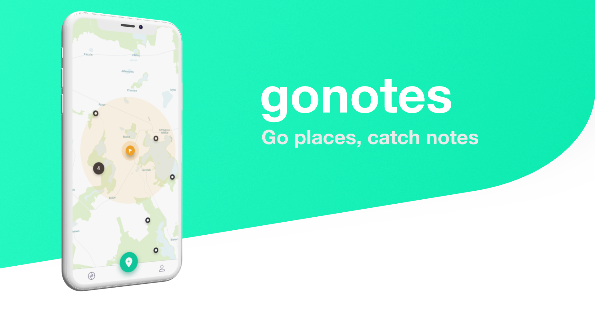

# gonotes 




## Installation

```bash
git clone https://github.com/daehruoydeef/gonotes
cd flatmap-client
flutter run
```

## ToDo

* add login flow
* add collected Notes screen
* add Profile screen
* change bottomNavigationBar label for collected Notes

## Contribution

### Getting Started

#### Install Flutter

A few resources to get you started if this is your first Flutter project:

- [Lab: Write your first Flutter app](https://flutter.dev/docs/get-started/codelab)
- [Cookbook: Useful Flutter samples](https://flutter.dev/docs/cookbook)

For help getting started with Flutter, view our 
[online documentation](https://flutter.dev/docs), which offers tutorials, 
samples, guidance on mobile development, and a full API reference.


#### Resolve a Bug

If you want to join the growing list of contributors this is the place to start. Maybe you  catched a bug you would like to resolve on your own.

In order to get you started:

- Fork the Project
- clone the Repo with Ssh
- create Virtual Device (Android or IOS)
- start the Debugger in Android Studio or VSCode
- solve the bug
- create a Pull request

Before start development please open an Issue 


### Donation

You can Donate via the GitHub Sponsors Program or use the LibraPay link where you can easily Donate with PayPal.


## Contributors

* be the first one :)


